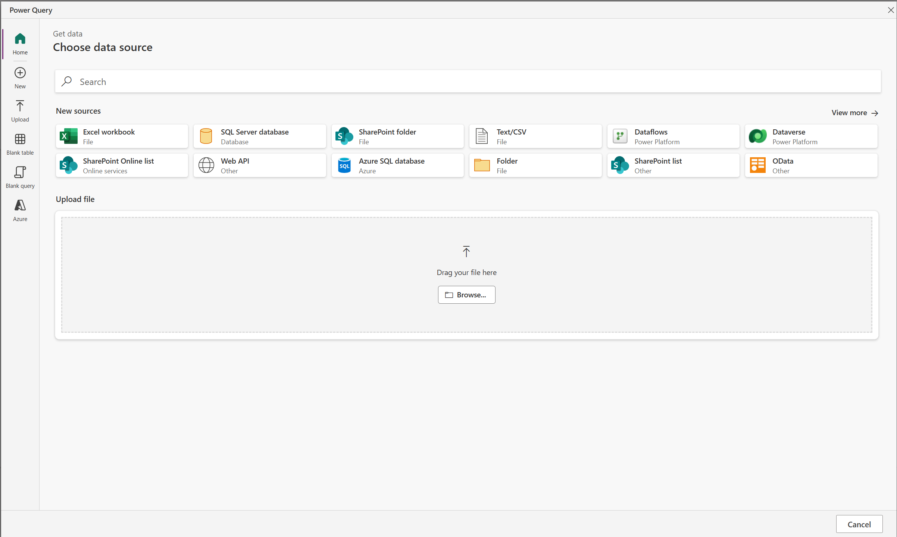

# Prerequisites

This workshop depends on a few prebuilt Power Platform components that need to be installed in your environment before starting with creating the agent. Please follow the below instructions first.

### Import solution

Import the starter solution by going to [make.powerapps.com](https://make.powerapps.com), navigate to solutions on the left hand side and press import solution. You can import the ContosoChatBaseSolution_1_0_0_0.zip file that is located in the prerequisites folder here. This will ask you to fill a Dataverse connection reference, which is used for some cloud flows that are part of the solution. This import can take a few minutes.

### Import sample data

The solution depends on some sample data, which is also added as excel files in the prerequisites folder. To import this data, please follow the below steps.

1. After the solution imported successfully, open the solution, you should see 4 tables in there.
2. Open the products table first. Click on import data and then on import. DO NOT use the import from excel option, instead you should have the import view like below.
3. Then, upload the product excel file. Sign in and afterwards walk through the wizard. Select the Products table, click next. After this, change the field types of the id column (to text) and the price column (to decimal). Continue and as destination, map the table to the existing contoso_product table. Map the columns and proceed the import. Finally, click on publish, this should load the data into the table.
4. After successful completion, the next table to import is the customer table. Repeat the steps above for the customer table. Load this into the contoso_customer table.
5. Then the order table, do the same as above, map it to the contoso_order table. Make sure to fill the first field with the customer number, as this will set the association between a customer and an order.
6. Last is the orderline table, this will be linked to product and order, so make sure to set these fields properly, and map the file to the contoso_orderline table

After these steps, all the test data should be in your environment.

