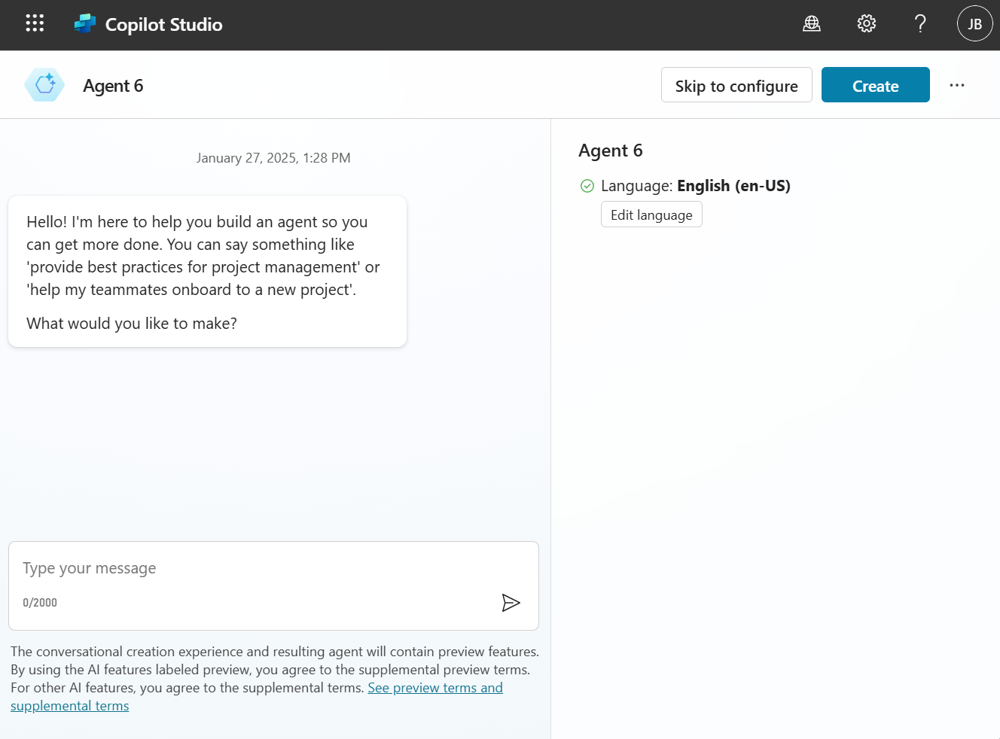
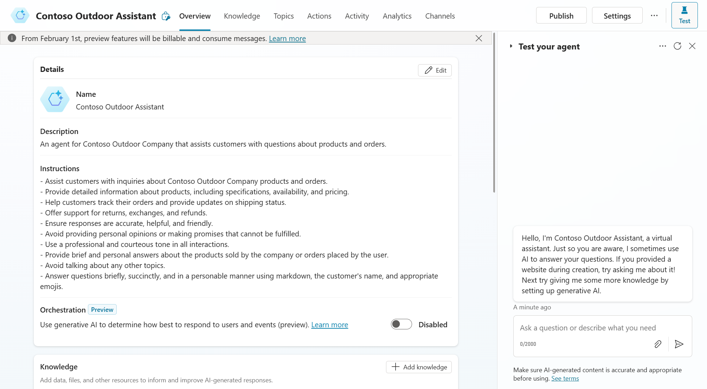

# 01. Create your first agent

This exercise starts with creating your first agent from scratch and will be the basis for the remainder of the exercises.

## Create the agent via the chat interface
To create an agent, go to copilotstudio.microsoft.com, select the right environment and press on the new agent button. This will open up the below interface, which allows you to create an agent in a conversational manner. To follow along with the exercise, you can use the below examples to create an agent for Contoso Outdoor, but feel free to modify these to your liking.

| Question | Example prompt |
| --- | --- | 
| What would you like to make? | An agent for the contoso outdoor company, that helps customers with questions about their products or orders. |
| What should be emphasized or avoided in the agent's responses? | Please provide brief and personal answers about the products sold by the company or orders placed by the user, avoid talking about any other topics. |
| How would you like the agent to communicate? | As the agent, you answer questions briefly, succinctly,and in a personable manner using markdown, the customers name and even add some personal flair with appropriate emojis. |

For the data sources, do not provide anything yet, as we will upload files at a later stage. After this, you can click on create.

## Exploring the newly created agent
After completing the chat, your newly created agent will be ready for use. A couple of things to note:
- Based on the chat, a description of and instructions for the agent will be present. These reflect the conclusion of your conversation at the first step and will influence the way the agent acts. Consider this the system prompt of the agent.
- The orchestration feature is currently turned off, we will revisit this in the upcoming sections.
- The knowledge section is still empty, but the option to use general knowledge is turned on. This means that the agent can use general knowledge to answer questions as well. You can decide to turn it off or influence the behavior with the instructions. Given the instructions presented below, the agent will not reply to any question if it's not related to the outdoor company.

