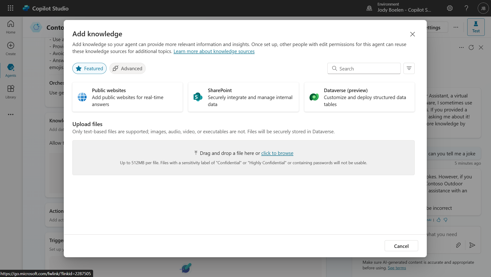
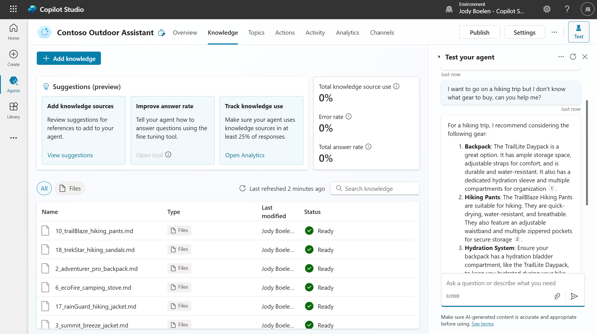

# 02. Adding knowledge

Now that the agent is created, it is time to add knowledge. There are various options for this, which we will not all explore. But definitely look into these for your own use-cases, for more information, see [knowledge sources](https://learn.microsoft.com/en-us/microsoft-copilot-studio/knowledge-copilot-studio).

## Uploading files as knowledge

Copilot studio has the possibility to index your files directly in Dataverse via a file upload. This is the option we will use in this exercise. The files we will upload are located in the data folder of this repository and contain information about the products that are sold by the Contoso Outdoor company.

To upload the files, go to the knowledge section of the agent and select add knowledge. In the pop-up, select the upload file option and upload the 20 files.

> For each file, you can change the name and description. These are important as these will be used by the agent to identify when each file should be used. For the purposes of this workshop, we will leave these as default, but for your own use-case, setting proper names and descriptions can greatly influence the behavior of the agent.

## Testing the files

After uploading the files, navigate to the knowledge tab. The files will be in a pending state, which means Dataverse is still indexing the files. Wait for these to be successfully indexed, after which you can start testing the agent. You can test the agent directly from Copilot Studio with the test pane on the right of your screen. Please find some example questions below, but feel free to test with your own questions:

- What hiking boots do you have?
- I want to go on a hiking trip but I don't know what gear to buy, can you help me?
- What can you tell me about the warranty you provide for the sleeping bag?

