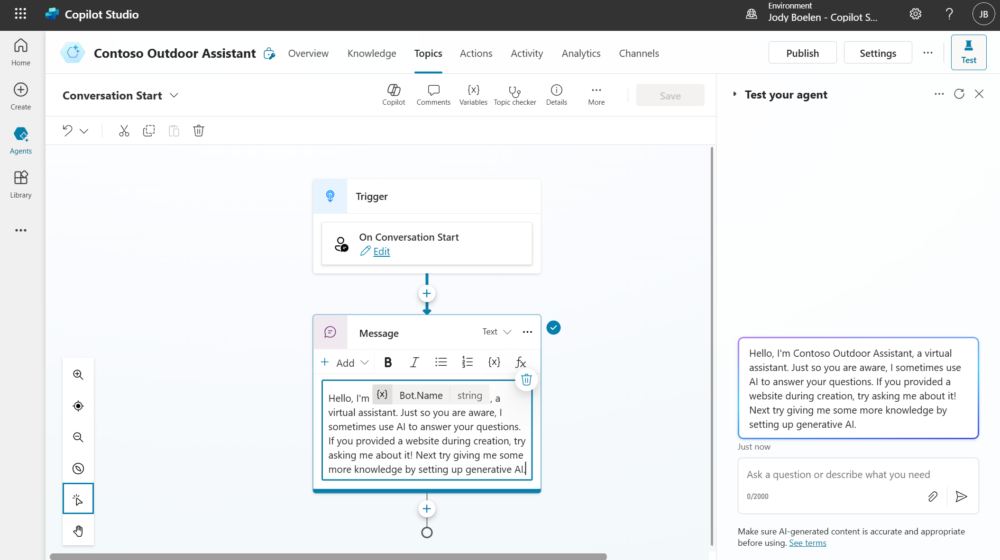
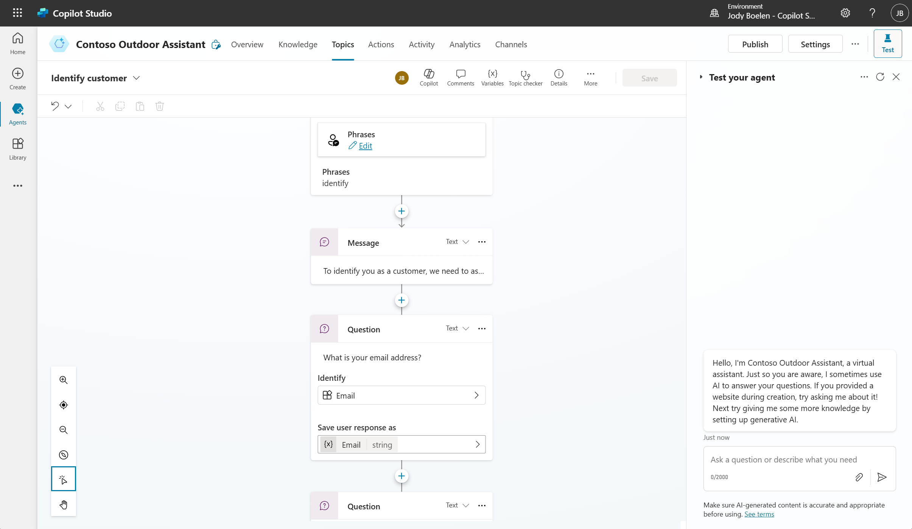
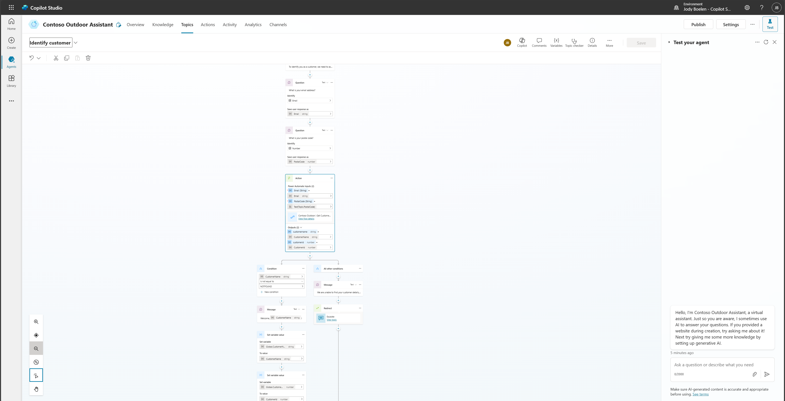

# Exploring topics

These workshops will mostly focus on the new generative AI capabilities of Copilot Studio. But for most agents, there is still a good use-case for scripted topics. Think about conversation flows that you want to fully influence, such as blocking a credit-card, ordering a product etc. For these flows, a scripted topic makes a lot of sense. This section will walk through creating one custom topic and shows a quick overview of the system topics, but for more details, see [topics in Copilot Studio](https://learn.microsoft.com/en-us/microsoft-copilot-studio/guidance/topics-overview).

## System topics

Each agent you create in Copilot Studio comes with default topics, called system topics. These are there for the agent to function and provide basic functionality, such as greeting the user or using generative answers to provide answers if there is no scripted topic available. Let's modify the greeting of the agent a bit. To do this, navigate to the topics section and go to the system topics. There will be a topic called "Conversation Start", you can open this topic and change the contents of the initial message to change the greeting of the agent.

## Adding a custom topic

Imagine we want to provide our customers with the functionality to place an order and ask questions about their existing orders. Currently we don't have any order functionality yet, but we will created this later on. However, one prerequisite for this is that our customers need to identify themselves. For this exercise, we will create a topic that will ask the customer a few questions to identify themselves, after which we can check if the customer is in the system.

> For production scenario's, this way of identifying is most likely not secure enough, but this is mostly for demo purposes.

1. Start by clicking on add topic -> start from blank.
2. Edit the trigger phrases, these phrases help the agent to identify when this topic should be triggered. In a later exercise, we will change the approach, so for now, only add a single trigger phrase: "identify". Note that this is only because we will move away from this in a later exercise, if you are actually using trigger phrases in a real use-case, refer to this documentation for best practices: [trigger phrases best practices](https://learn.microsoft.com/en-us/microsoft-copilot-studio/guidance/trigger-phrases-best-practices).
3. Start with a simple message node to notify the user that we will require some information, such as "To identify you as a customer, we need to ask you for some information.".
4. Add two question nodes, to get the email of the user and the postal code. These will be used to identify the end-user. Note the option to save the user response as the full response, change this to email in the first question and number for the postal code question (see below).
5. After the questions, add an action and select a cloud flow called "Contoso Outdoor | Get Customer Details", this flow mimics a back-end system and looks up the customer based on the inputs you provide. Note that this flow takes in two arguments, the email and the postal code. For the postal code, you need to cast the number value to a string using powerFX: `Text(Topic.PostalCode)`.
6. The flow returns the customer name and id, if no customer is found, the customer name will be NOTFOUND. Add a condition in the conversation flow to capture this. When a customer name is found, greet the user by using their name.
7. Finally, save the two values returned from the cloud flow as global variables, as these will be useful later on.

## Completed custom topic
After following the above steps, your topic should look something like the below. For the example below, you can also find the YAML code in the samples folder. To use this one, go to your topic, click on more and open the code viewer. Then you can fully paste the YAML code in there.

