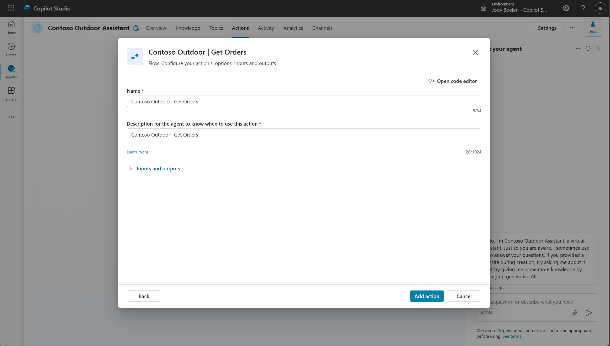

# Adding an action

Now, the agent can answer questions about the products we sell and it is able to identify a customer. The next step is to provide the agent with the ability to look up the orders of a customer. We will do this by adding an action, which is basically an API that the agent will be able to call. To add an action, go to the actions tab and select the "Contoso Outdoor | Get Orders" flow. And press add action.

## Configuring the action

This cloud flow returns a list of orders for a particular customer. To make sure the agent knows when and how to call the action, we need to do some configuration. Select the newly added action, which opens a details page. Use the below table for filling in the details, but of course, feel free to modify some of these details. These are important to fill in properly, as this will influence when and if the agent will call this action for you.

| Field | Example |
| --- | --- | 
| Action Name | Leave as is. |
| Display Name | Get orders for a customer |
| Description for the agent to know when to use this action | Use this action when a customer asks questions about their orders, such as "what is my latest order" or "what products did I order". Only call this action when the customerId is already known, if not, first identify the customer using the identify topic. |
| Ask the user for confirmation | Leave this unchecked. |
| CustomerId (Inputs tab): Description | Always fill this with the customer id, which is a number, no additional details should be added in this field. |
| Orders (Outputs tab): Description | Contains a json array of orders and products for each order. The orderNumber should always be provided to the user as this is an identifier, however the orderline number is not relevant for the user and should not be used.  |

After configuring, we will not use the action just yet, so you can continue to the next exercise.