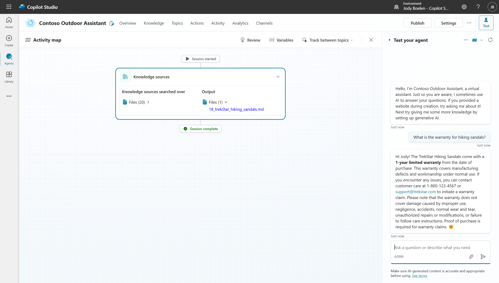

# Generative AI

In this section, we will change the behavior of the agent significantly. In the classic mode, the agent works based on a Natural Language Understanding model that identifies user intent and based on that, redirects to conversation to the right topic. We will change to the new, generative AI, mode in this section, as this will provide new capabilities, making the agent way more powerful.

## Turning on generative AI

To turn on generative AI, go to the settings tab, then to Generative AI and turn on "Generative AI (preview)". Save the agent afterwards. We will cover how this changes our agent in the below sections, but for more details, please see [generative orchestration](https://learn.microsoft.com/en-us/microsoft-copilot-studio/advanced-generative-actions).

## Revisit the identify customer topic

After the step above, go back to the "Identify customer" topic we created in step 3. Notice that the trigger phrases are no longer there, but the trigger is now called "Triggered by an agent", is also contains a generic description that includes your original trigger phrase.

This description is used by the planner capability of the agent that we enabled by turning on the generative mode, which basically means that the agent will decide when to use this topic based on the description your provide. In this case, we want to trigger this topic when we need to identify the customer, so as an example, add the following description:

> This topic is used to identify a customer and should be triggered when the customer wants to get details about their orders and the customerID is not yet known. When the customer only wants generic product information and the customerID is not relevant, this topic should not yet be triggered.

Next, also remove the welcome message we added in step 3, as this is not necessary for now and will only confuse the end-user.

## Explore the new capabilities

Now we are ready to explore the new planner capabilities. The agent will be able to create a plan of actions/tools that should be used to answer a customer question, after which it will create a single response that answers the question. As this can be a bit vague, let's walk through a couple of examples:

### 1. Simple question about the warranty
Similar to how we tested asking a question about products in exercise 1, we can still do that here. Let's start with this basic scenario and ask the agent the following question `What is the warranty for hiking sandals?`. Notice that the UI changed a bit, and we see an activity map that highlights all the steps the agent takes to answer the user question. Since this is a simple one-shot question, there is only one step, namely looking into the knowledge sources.

### 2. Asking order information
Now let's make it a bit more complex and ask about order information, recall that we need to do a few things to answer these type of questions, we need to identify the customer first, then call the action we added to retrieve order information. If we ask a question about our last order, we even need to analyze the output of the retrieve order action and select only the relevant information. Let's test this with the following ask `When did I place my last order?`. Based on this question, the agent should to the following:
1. First identify the customer as this is not known yet, so it should go to the topic we created.
2. Then it should call the action we added in lab 4 to get order information.
3. Then it should look into the response of step 2 and get out the relevant information.

To test this, use the following email and postal code: davidkim@example.com, 23456. Notice how the agent plans two action and uses the outputs of these actions to respond to the end user.

### 3. Asking a more complex question
Let's combine the two questions above to see how the planner capabilities can help answer more complex questions. Ask for the warranty information of your last order, get the answer, the agent should do all the steps from example 2, but also look into the knowledge source to get warranty information. Try it out to see it in action. Notice how the agent uses all three actions and returned information to create a single answer for the customer. You can also ask follow up questions, like `What what my order number for this?`.

