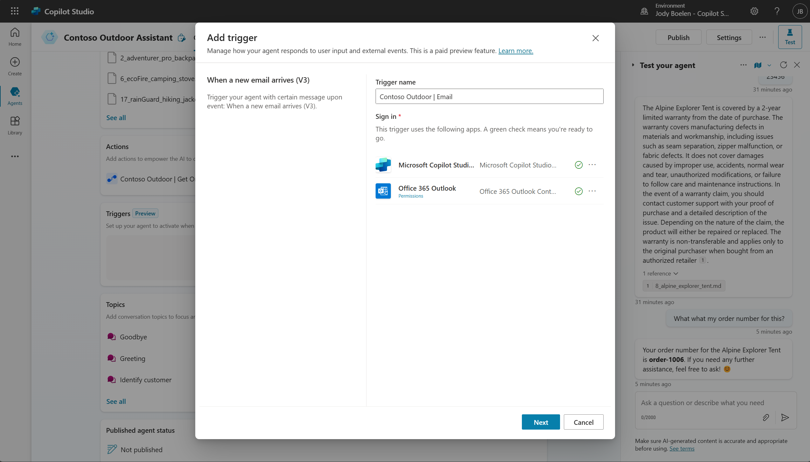
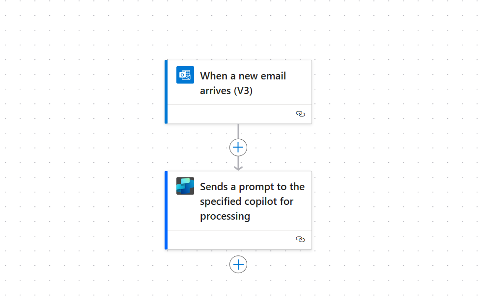
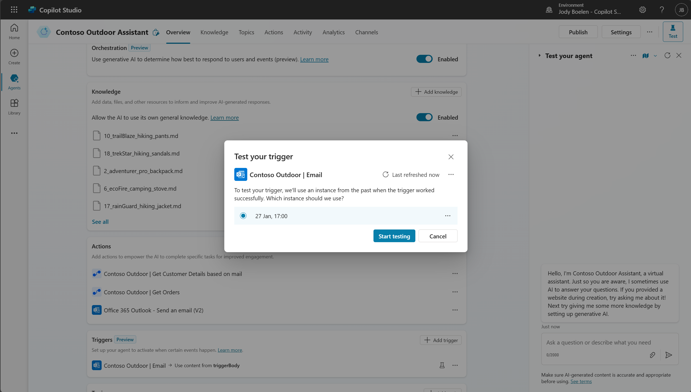
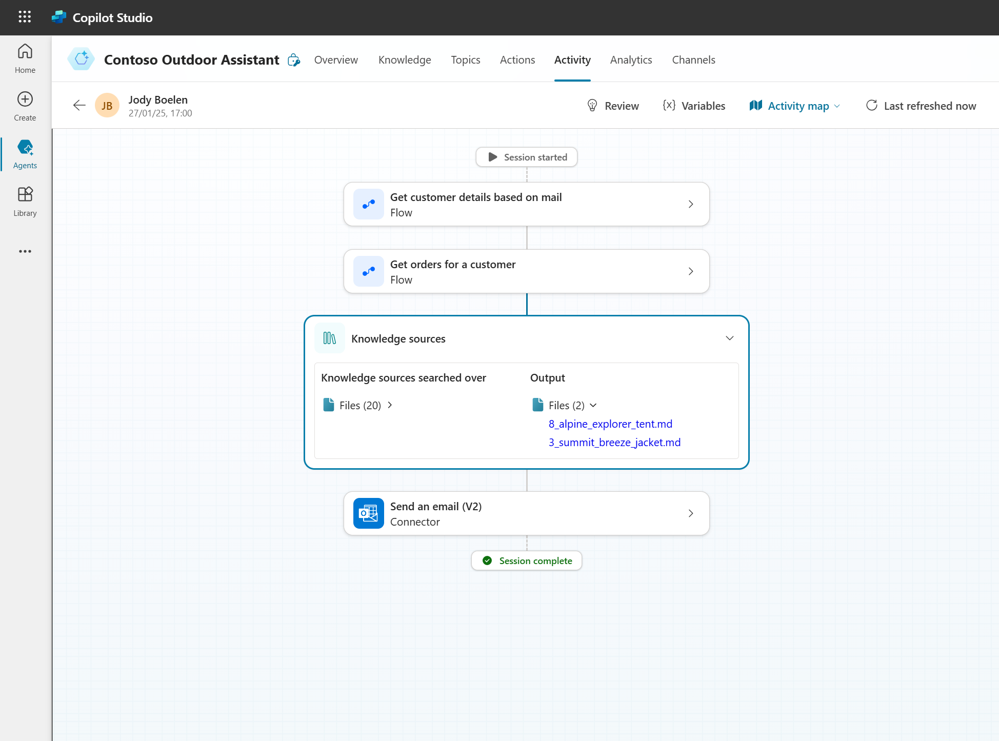
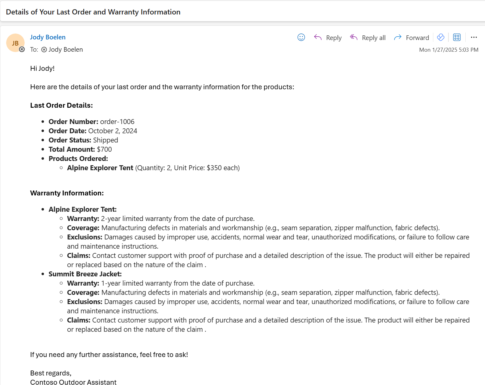

# Autonomous capabilities

Up until now, we always started a conversation with the agent to get information. However, Copilot Studio can do more than this with its autonomous capabilities. The agent can work in the background and handle events on its own without the end-user needing to start a chat. As an example, let's assume that we also have a contact center that can be mailed. We now want to respond to user questions via mail automatically, as we have an agent that has all the required information. Let's use the autonomous agent capabilities of Copilot Studio for this.


## Create a trigger

To enable this functionality, we need to first add a trigger to our agent. Go to the overview tab and add a trigger. Select the "when an email arrives" trigger. Fill in the details in the pop-up, select the folder that the flow should look into and provide a subject filter (optional), for example `contoso`.



This pop-up will create a cloud flow in the background that will use the regular cloud flow Outlook trigger. It will then call Copilot Studio via the new connector. You can see this cloud flow by clicking on the ellipsis next to the newly added trigger, and open in power automate.



## Add additional actions

When we get an email from a customer, it is useful to immediately have the agent look up the relevant customer details, similar to how we created the topic to authenticate. Also, we want the agent to respond via mail if a question comes in via email. To add these functionalities, let's add two more actions to the agent.

### Customer lookup action

In the provided solution, another cloud flow is provided called "Contoso Outdoor | Get Customer Details based on mail". Add this as an action and provide the relevant descriptions so that the agent knows when to use this. As an example:

> Use this action only when the conversation is triggered from an incoming email, otherwise never use this action. In case of the email trigger, start with this action to get the customerId based on the email sender, as this information is required for follow-up actions.

> Note that this flow will always use the email davidkim@example.com, instead of the actual sender of the mail, as we are using fake email addresses.


### Send email action

Next we want to provide the agent the capability of sending emails. For this, we can use the built-in Office 365 Outlook connector. Go to the actions tab again and search for the "Send an Email (V2)" action of the Office 365 Outlook connector.

Just as before, provide a useful description of what the action does and when it should be used:

```
This action should be used to respond to user queries via email, so when the conversation gets triggered based on an email, always end with this action to send a reply to the user that started the conversation. Never use this for a regular chat.
```

> Set the authentication to copilot author authentication!

After saving, go into the action to modify some of the fields with these example prompts (or your own!):

| Field | Example |
| --- | --- | 
| To | Use the email of the person who initiated the question via mail. |
| Subject | A one sentence summary of the topic of the email. |
| Body | This should contain html text to ensure the text renders nicely in the email. |

## Test the autonomous agent functionality

Now we are ready to test the autonomous agent functionality, you can do this by sending yourself an email with a question, such as the final question we used in the last lab. This will trigger the cloud flow. After this, go can go back into Copilot Studio and locate the trigger, you can test this trigger by clicking on the test icon next to it:



You can see the entire planning capability, similar to how you could see it from the regular test pane:



Finally, it should result in an email like the one below.

